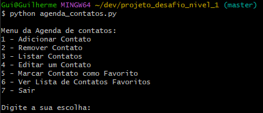

# Meu Primeiro Projeto na Formação Python pela Rocketseat! 🚀

✪ Agenda de Contatos

## Descrição
Este repositório contém o código e os arquivos do meu projeto inicial na jornada de aprendizado de Python com a Rocketseat. O objetivo deste projeto é aplicar os conceitos básicos e fundamentais da linguagem Python, adquiridos ao longo do curso.

## Sobre o desafio

Nesse desafio desenvolveremos uma agenda para salvar, editar, deletar e marcar um contato como favorito. O resultado da aplicação deve ser apresentado no terminal, assim como foi visto no módulo “Introdução ao Python”.

### Regras da aplicação

- A aplicação deve iniciar mostrando uma lista de opções do que é possível fazer com o app e permitir que o usuário digite uma escolha para iniciar a aplicação.
- Deve ser possível adicionar um contato
    - O contato pode ter os dados:
    - Nome
    - Telefone
    - Email
    - Favorito (está opção é para poder marcar um contato como favorito)
- Deve ser possível visualizar a lista de contatos cadastrados
- Deve ser possível editar um contato
- Deve ser possível marcar/desmarcar um contato como favorito
- Deve ser possível ver uma lista de contatos favoritos
- Deve ser possível apagar um contato

